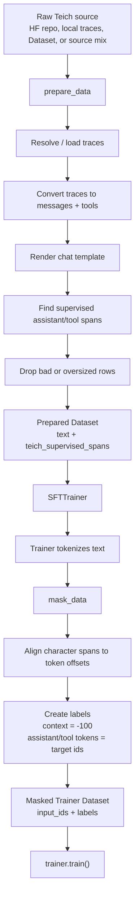

# [prepare_data](cci:1://file:///c:/Users/aranr/Documents/github/agentic-datagen/v2/src/teich/prepare.py:141:0-206:5) Flow

```mermaid
flowchart TD
    A["User calls prepare_data(source_or_dataset, tokenizer, ...)"] --> B["Resolve HF auth token"]
    B --> B1{"token and hf_token both passed?"}
    B1 -->|"different values"| B2["Raise ValueError"]
    B1 -->|"one value / same value / neither"| C["Resolve source_or_dataset"]

    C --> D{"Input type?"}

    D -->|"datasets.Dataset"| E["Use Dataset directly"]
    E --> E1{"max_examples set?"}
    E1 -->|"yes"| E2["shuffle(seed=3407) + select max_examples"]
    E1 -->|"no"| F["Resolved Dataset"]
    E2 --> F

    D -->|"str or Path"| G["load_traces(source, split, revision, token, cache_dir, local_dir, max_examples)"]
    G --> G1{"Local path exists?"}
    G1 -->|"yes"| G2["Use local file / directory"]
    G1 -->|"no"| G3["snapshot_download HF dataset repo"]
    G3 --> G4["Downloads JSONL + README.md + tools snapshot files"]
    G2 --> G5["Find split directory if present"]
    G4 --> G5
    G5 --> G6["convert_traces_to_training_data"]
    G6 --> G7["Apply tool schema snapshot from README.md or tools.json"]
    G7 --> G8["Create datasets.Dataset"]
    G8 --> G9{"max_examples set?"}
    G9 -->|"yes"| G10["shuffle(seed=3407) + select max_examples"]
    G9 -->|"no"| F
    G10 --> F

    D -->|"sequence of plain sources"| H["Resolve each source independently"]
    H --> I["format_data handles sequence"]
    I --> I1["Format each Dataset independently"]
    I1 --> I2["concatenate_datasets"]
    I2 --> Z["Return prepared text Dataset"]

    D -->|"mapping or sequence with source configs"| J["Parse source mix"]
    J --> J1["Read source, name, percentage / weight, per-source max_examples"]
    J1 --> J2["Compute mix probabilities"]
    J2 --> J3["Resolve each source independently"]
    J3 --> K["Format each source independently"]
    K --> K1["Allocate row counts from probabilities + available rows + global max_examples"]
    K1 --> K2["Shuffle each source, select allocated rows"]
    K2 --> K3["Concatenate selected sources"]
    K3 --> K4["Final deterministic shuffle(seed=3407)"]
    K4 --> Z

    F --> L["format_data(Dataset, tokenizer, ...)"]
    L --> M["Validate chat_template_kwargs"]
    M --> N["Resolve text tokenizer"]
    N --> O["Resolve chat template renderer"]
    O --> P["dataset.map over rows"]

    P --> Q["Validate messages column is a list"]
    Q --> R["Validate tools column is a list or default []"]
    R --> S["_supervised_text_and_spans"]

    S --> S1["Deep-copy assistant messages"]
    S1 --> S2["Inject invisible markers around trainable assistant fields"]
    S2 --> S3["Trainable fields: assistant content, tool call name, tool call arguments"]
    S3 --> S4{"train_on_reasoning?"}
    S4 -->|"true"| S5["Also mark assistant reasoning_content"]
    S4 -->|"false"| S6["Do not mark reasoning_content"]
    S5 --> S7["Render marked chat template"]
    S6 --> S7
    S7 --> S8["Strip markers and collect character spans"]
    S8 --> S8A{"Markers collected cleanly?"}
    S8A -->|"no"| S8B["Render original chat template and infer assistant/model spans"]
    S8B --> S8C{"Fallback spans found?"}
    S8C -->|"yes"| T
    S8C -->|"no and strict=True"| S11["Raise ValueError"]
    S8C -->|"no and strict=False"| S12["Return original text with no spans"]
    S8A -->|"yes"| S9["Render original chat template"]
    S9 --> S10{"Marked-stripped text equals original text?"}
    S10 -->|"no and strict=True"| S11["Raise ValueError"]
    S10 -->|"no and strict=False"| S12["Infer assistant/model spans from original text"]
    S10 -->|"yes"| S13["Infer assistant prompt prefixes"]
    S13 --> S14["Expand spans to include desired assistant output wrappers"]
    S14 --> S15{"train_on_reasoning?"}
    S15 -->|"true"| S16["Keep reasoning spans; Qwen <think> start tag is supervised"]
    S15 -->|"false"| S17["Subtract reasoning blocks from supervised spans"]
    S16 --> T["Return text + supervised spans"]
    S17 --> T
    S12 --> T

    T --> U{"Any supervised spans?"}
    U -->|"no and strict=True"| U1["Raise ValueError"]
    U -->|"no and strict=False"| U2["Drop row"]
    U -->|"yes"| V{"drop_oversized_examples and max_length set?"}
    V -->|"yes"| V1["Tokenize only to measure length"]
    V1 --> V2{"length > max_length?"}
    V2 -->|"yes"| V3["Drop oversized row"]
    V2 -->|"no"| W["Emit prepared row"]
    V -->|"no"| W

    W --> X["Output columns only: text + teich_supervised_spans"]
    X --> Z
```



## What [prepare_data](cci:1://file:///c:/Users/aranr/Documents/github/agentic-datagen/v2/src/teich/prepare.py:141:0-206:5) returns

[prepare_data](cci:1://file:///c:/Users/aranr/Documents/github/agentic-datagen/v2/src/teich/prepare.py:141:0-206:5) returns a **trainer-friendly text dataset**, not final labels.

Each row looks conceptually like:

```python
{
    "text": "<rendered chat template string>",
    "teich_supervised_spans": [
        {"start": 123, "end": 180},
        {"start": 220, "end": 260},
    ],
}
```

With `tokenize=True`, rows also include `input_ids` and `attention_mask`. Use this mode for the recommended Unsloth / TRL flow so trainer setup treats the dataset as already tokenized and preserves `teich_supervised_spans` until `mask_data()` runs.

Important details:

- **`text`** is what `SFTTrainer` / Unsloth tokenizes when `tokenize=False`; with `tokenize=True`, it stays available for Teich span alignment and preview.
- **`teich_supervised_spans`** are character spans telling Teich what assistant/tool tokens should become labels later.
- **Original columns are removed** after formatting.
- **Oversized examples are measured and dropped** if `drop_oversized_examples=True`; token IDs are kept only when `tokenize=True`.

# [mask_data](cci:1://file:///c:/Users/aranr/Documents/github/agentic-datagen/v2/src/teich/formatter.py:1252:0-1360:18) Flow

```mermaid
flowchart TD
    A["User creates SFTTrainer with train_dataset from prepare_data"] --> B["Trainer tokenizes text dataset"]
    B --> C["User calls mask_data(trainer, ...)"]

    C --> D["Resolve tokenizer"]
    D --> D1["Priority: explicit tokenizer"]
    D1 --> D2["Then trainer.processing_class"]
    D2 --> D3["Then trainer.tokenizer"]

    C --> E["Resolve text column"]
    E --> E1["Explicit text_column if passed"]
    E1 --> E2["Else trainer.args.dataset_text_field"]
    E2 --> E3["Else default: text"]

    C --> F["Resolve max supervised token limit"]
    F --> F1["max_supervised_tokens if positive"]
    F1 --> F2["Else trainer.args.max_length if positive"]
    F2 --> F3["Else no supervised-token cap"]

    C --> G{"trainer.args.packing enabled?"}
    G -->|"yes"| G1["Raise ValueError: packing not supported"]
    G -->|"no"| H["Mask train_dataset and eval_dataset"]

    H --> I{"Dataset target"}
    I -->|"train_dataset"| J["Process trainer.train_dataset"]
    I -->|"eval_dataset Dataset"| K["Process trainer.eval_dataset"]
    I -->|"eval_dataset dict"| L["Process each eval split independently"]

    J --> M["_mask_dataset(dataset, dataset_name)"]
    K --> M
    L --> M

    M --> N{"dataset is None?"}
    N -->|"yes"| N1["Return None"]
    N -->|"no"| O{"Is datasets.Dataset?"}
    O -->|"no"| O1["Raise TypeError"]
    O -->|"yes"| P{"input_ids present?"}

    P -->|"no, but text column present"| Q["Tokenize text column"]
    Q --> Q1["Create input_ids + attention_mask"]
    Q1 --> R["Continue"]

    P -->|"yes"| R
    P -->|"no and no text fallback"| P1["Raise ValueError: missing input_ids"]

    R --> S["dataset.map over tokenized rows"]
    S --> T["_mask_tokenized_row"]

    T --> U["Extract tokenized input_ids"]
    U --> V{"Row has text and teich_supervised_spans?"}

    V -->|"yes: normal Teich path"| W["Retokenize original text with offset mappings"]
    W --> W1["Convert character spans into token labels"]
    W1 --> W2{"Trainer input_ids align with full text tokenization?"}
    W2 -->|"exact match"| W3["Use full labels"]
    W2 -->|"prefix match due to truncation"| W4["Truncate labels to input_ids length"]
    W2 -->|"mismatch"| W5["Raise ValueError: token alignment failed"]

    V -->|"no: fallback path"| X["Decode input_ids back to text with offsets"]
    X --> X1["Infer supervised assistant/tool spans from rendered template markers"]
    X1 --> X2["Convert inferred spans into token labels"]

    W3 --> Y["Validate labels"]
    W4 --> Y
    X2 --> Y

    Y --> Y1{"All labels are -100?"}
    Y1 -->|"yes"| Y2["Raise ValueError: fully masked row"]
    Y1 -->|"no"| Z["Return input_ids + labels"]

    Z --> AA["Count supervised tokens"]
    AA --> AB{"supervised tokens > max_supervised_tokens?"}
    AB -->|"yes"| AB1["Drop row"]
    AB -->|"no"| AC["Keep row"]

    AC --> AD["Output masked dataset columns: input_ids + labels"]
    AB1 --> AD

    AD --> AE{"Any rows left?"}
    AE -->|"no, because supervised-token cap dropped all"| AE1["Raise ValueError"]
    AE -->|"yes"| AF{"audit enabled?"}

    AF -->|"yes"| AG["audit_sft_dataset(masked_dataset)"]
    AG --> AG1["Raise on masking/audit errors"]
    AF -->|"no"| AH["Skip audit"]
    AG1 --> AI["Attach preview helper"]
    AH --> AI

    AI --> AJ["Replace trainer.train_dataset / eval_dataset with masked datasets"]
    AJ --> AK["Return trainer"]
```



## What [mask_data](cci:1://file:///c:/Users/aranr/Documents/github/agentic-datagen/v2/src/teich/formatter.py:1252:0-1360:18) changes

Before [mask_data](cci:1://file:///c:/Users/aranr/Documents/github/agentic-datagen/v2/src/teich/formatter.py:1252:0-1360:18), the trainer dataset is typically:

```python
{
    "text": "...",
    "teich_supervised_spans": [...],
    "input_ids": [...],
    "attention_mask": [...],
}
```

After [mask_data](cci:1://file:///c:/Users/aranr/Documents/github/agentic-datagen/v2/src/teich/formatter.py:1252:0-1360:18), Teich replaces trainer datasets with:

```python
{
    "input_ids": [...],
    "labels": [-100, -100, 1234, 5678, ...],
}
```

Where:

- **`-100`** means “ignore this token in loss.”
- **Non-`-100` labels** are the exact assistant/tool/reasoning tokens Teich wants the model to learn.
- Prompt/user/system/tool-output context stays masked.
- Assistant answer content and tool calls become supervised.
- If `train_on_reasoning=True`, reasoning content is supervised too.
- For Qwen-style templates, the initial `<think>` tag is intentionally included in supervision.

# Compact Combined Flow

This version is easier to put in a README or slide.



# Plain-English Explanation

- **[prepare_data](cci:1://file:///c:/Users/aranr/Documents/github/agentic-datagen/v2/src/teich/prepare.py:141:0-206:5) is the formatting stage**
  - It loads raw traces or datasets.
  - It renders them with the model tokenizer’s chat template.
  - It records exactly which character ranges should be trained on.
  - It returns a clean text dataset for the trainer.

- **`SFTTrainer` is the tokenization stage**
  - The trainer turns `text` into `input_ids`.

- **[mask_data](cci:1://file:///c:/Users/aranr/Documents/github/agentic-datagen/v2/src/teich/formatter.py:1252:0-1360:18) is the label stage**
  - It aligns Teich’s saved character spans to token offsets.
  - It creates `labels`.
  - It masks prompt/context tokens with `-100`.
  - It leaves assistant/tool/reasoning targets unmasked.

# Key Guarantee

The important design is:

```text
prepare_data keeps human-readable text + supervision spans.
mask_data converts those spans into exact token-level labels after trainer tokenization.
```

This lets Teich stay compatible with Unsloth / TRL trainer flows while still controlling exactly what the model learns.
