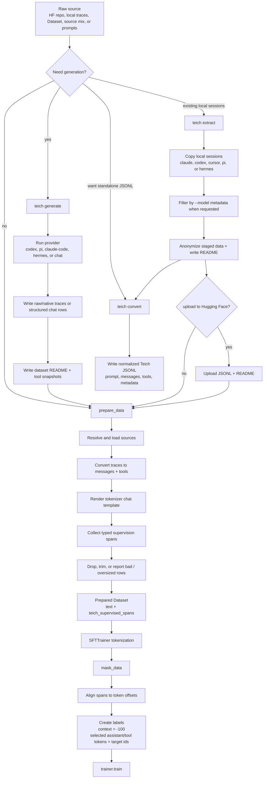
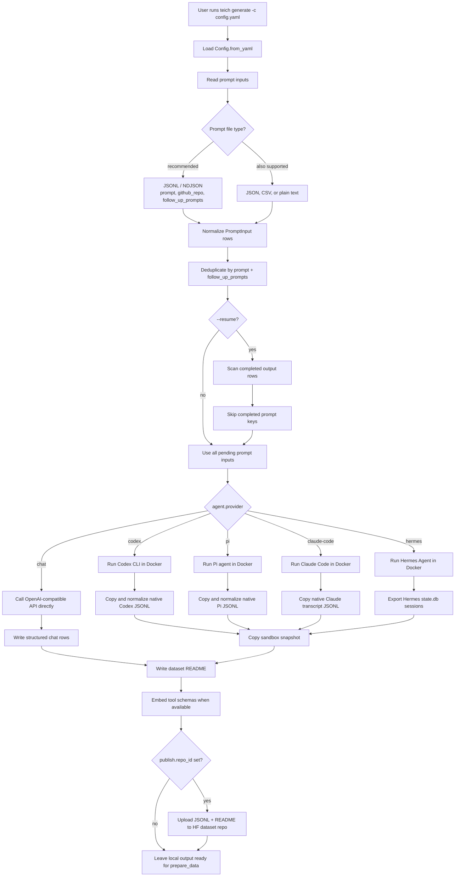
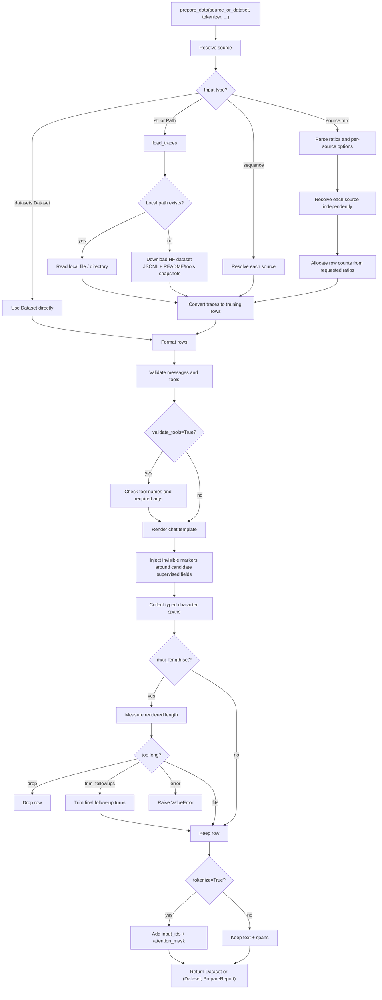
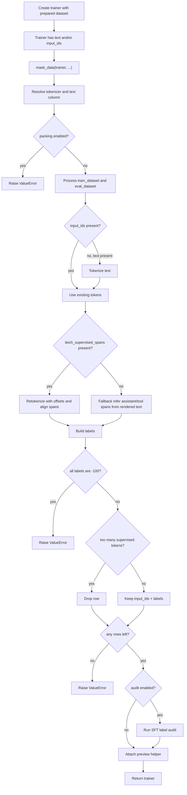

# Pipeline Flow

This page describes how Teich moves from raw data to trainer labels.

## Combined Flow



## Generation Flow



## `prepare_data()` Flow



## `mask_data()` Flow



## Key Guarantee

```text
prepare_data keeps human-readable text plus typed span metadata.
mask_data converts the selected spans into exact token-level labels after trainer tokenization.
teich convert writes normalized message JSONL without tokenizer rendering or token labels.
```

This lets Teich stay compatible with TRL / Unsloth trainer flows while still controlling exactly what the model learns.
